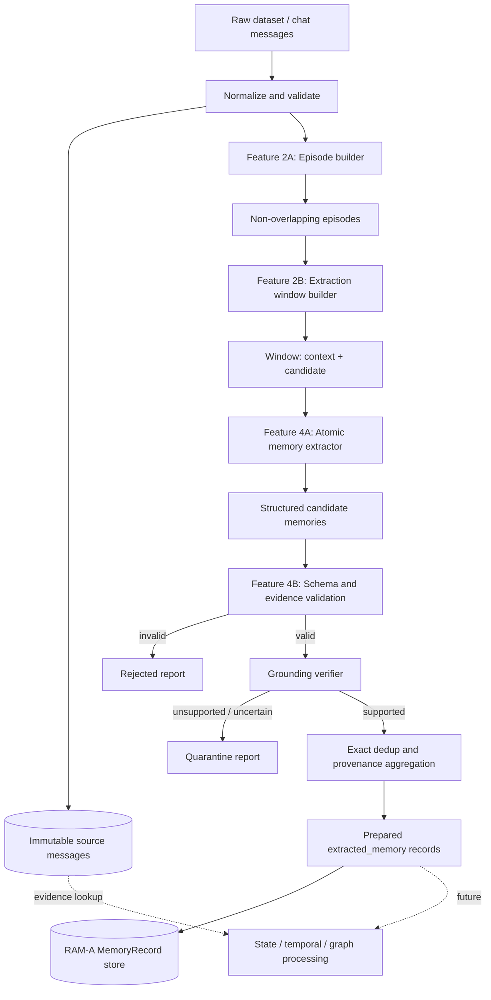
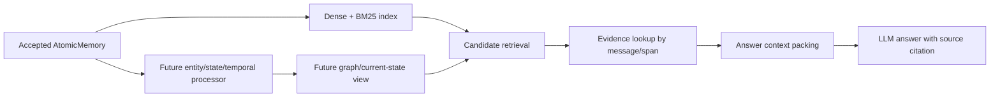

# RAM-A 特性 2/4：对话证据组织与原子记忆抽取设计

> 状态：设计已收敛，等待实现计划
>
> 当前范围：特性 2 `Deterministic Episode and Extraction Window Construction` 与特性 4 `Evidence-Grounded Atomic Memory Extraction`
>
> 核心目标：改善写入 RAM-A 的记忆内容质量，同时保持原始证据可追溯、处理结果可复现，并为后续 search、answer、state evolution 和 graph memory 提供稳定输入。

## 1. 背景与问题

RAM-A 当前可以保存 `MemoryRecord`，并执行 dense、BM25、hybrid search 和 metadata filter，但上游写入内容仍然接近原始 turn。原始 turn 直接作为长期记忆存在以下问题：

- 单条 turn 可能依赖前文指代，脱离上下文后语义不完整；
- 一条消息可能包含多个事实、偏好或事件，不是原子检索单元；
- assistant 复述、寒暄和过程性内容会污染长期记忆；
- 事实、计划、猜测和否定没有区分；
- memory 无法精确回到支持它的原始消息和文本片段；
- 后续状态变化、冲突判断和图关系构建缺少稳定结构。

传统文档 RAG 通常把 chunk 同时作为切分、embedding 和检索单元。长期记忆系统的目标不同：原始消息负责提供证据，抽取窗口负责提供理解上下文，原子记忆负责长期保存和检索。这三类对象不能继续由一个 `raw_chunk` 同时承担。

因此本设计采用四层模型：

1. `NormalizedMessage`：不可变的原始证据；
2. `ConversationEpisode`：不重叠的对话组织单元；
3. `ExtractionWindow`：供 LLM 理解上下文的临时输入；
4. `AtomicMemory`：自包含、可验证、适合检索的长期记忆单元。

## 2. 设计结论

### 2.1 核心决策

- 不把 RAG 风格的 raw chunk 作为默认长期记忆。
- 特性 2 只负责确定性组织原始证据和构造抽取窗口，不负责生成语义 memory。
- episode 必须不重叠；extraction window 可以有 context overlap。
- 每个 extraction window 明确区分 `candidate` 和 `context`：只有 candidate 消息可以触发新 memory 写入，context 只用于消歧。
- 特性 4 输出 evidence-grounded atomic memory；进入 RAM-A 检索索引的是 atomic memory 的自包含文本。
- 原始 message 是 source of truth。memory 必须保存 evidence reference，必要时可回取原文。
- 模型自报 confidence 只用于诊断，不作为防止幻觉的主要门禁。
- 第一阶段不做语义 merge、自动 conflict resolution、state projection 或 graph store。
- 第一阶段为后续能力保留 subject、predicate、object、time、modality 和 evidence 等字段，但不要求当前 RAM-A 理解全部字段。

### 2.2 非目标

本阶段不实现：

- raw episode 的正式检索和 fallback 策略；
- query intent、temporal query planning；
- answer context packing 和引用生成；
- semantic dedup、自动 merge/delete；
- preference/current-state 自动更新；
- conflict resolution、supersedes/invalidation 决策；
- entity resolution 服务和 graph store；
- 跨全部历史的主动检索式 memory extraction。

这些能力只在第 12 节说明消费接口，不进入当前验收范围。

## 3. 为什么不是传统 Chunking

### 3.1 不同阶段需要不同粒度

| 单元 | 目标 | 是否允许改写 | 是否允许重叠 | 是否默认 embedding |
| --- | --- | --- | --- | --- |
| `NormalizedMessage` | 保存原始事实和说话者信息 | 否 | 否 | 否 |
| `ConversationEpisode` | 确定性组织一段连续对话 | 否 | 否 | 否 |
| `ExtractionWindow` | 给 extractor 足够上下文 | 否 | context 可重叠 | 否 |
| `AtomicMemory` | 长期保存、检索和后续推理 | 是，但必须忠于证据 | 不适用 | 是 |

embedding 希望输入主题集中、自包含；LLM extraction 则需要足够上下文来解析指代、角色和时间。如果使用同一个小 chunk 同时满足两者，容易丢失跨 turn 联系；如果使用同一个大 chunk，又会增加噪声和抽取遗漏。

本设计通过“较完整的 extraction window + 较小的 atomic memory”解决这个冲突。

### 3.2 行业实践映射

- Mem0 接收 ordered messages，默认从对话中抽取事实再写入 memory；原始消息不是默认主检索单元。参考：[Mem0 Add Memory](https://docs.mem0.ai/core-concepts/memory-operations/add)。
- Graphiti 使用 episode 表示一次原始数据摄入事件，支持 text、message 和 JSON；message episode 可以包含多轮对话。参考：[Graphiti Adding Episodes](https://help.getzep.com/graphiti/core-concepts/adding-episodes)。
- LangGraph 把长期语义记忆建模为 profile 或 memory collection 中的 JSON document，而不是固定 token transcript chunk。参考：[LangGraph Memory Overview](https://docs.langchain.com/oss/python/concepts/memory)。

RAM-A 当前阶段采用 episode 组织证据、atomic memory 负责检索，与这些系统的职责划分一致，但仍保留可复现的 benchmark pipeline。

## 4. 总体架构



### 4.1 数据不变量

整个 pipeline 必须满足：

1. 不跨 `scope_id` 混合数据；
2. 不跨显式 `session_id` 构造 episode 或 window；
3. 同一 session 中每条有效 message 恰好属于一个 episode；
4. 每条有效 message 恰好属于一个 window 的 candidate 区域；
5. message 可以出现在其他 window 的 context 区域；
6. context 消息不能单独触发新 memory；
7. 每条入库 memory 至少有一条 candidate evidence；
8. evidence 必须能回到 source message 和原文 span；
9. 相同输入、配置和版本必须产生 byte-stable 的 episode/window manifest；
10. LLM 输出失败不能修改或污染原始 source data。

## 5. 特性 2：Episode 与 Extraction Window

### 5.1 输入：NormalizedMessage

```python
@dataclass(frozen=True)
class NormalizedMessage:
    id: str
    scope_id: str
    text: str
    role: str
    speaker: str = ""
    timestamp: str = ""
    session_id: str = ""
    turn_index: int | None = None
    metadata: dict[str, Any] = field(default_factory=dict)
```

字段约束：

- `id` 在同一 dataset run 中唯一；
- `scope_id` 必填，用于用户/样本隔离；
- `text` 保留原文，不进行摘要或语义改写；
- `role` 使用 `user|assistant|system|tool|other` 规范值；
- `speaker` 在多人对话中必填；
- `timestamp` 如果存在，统一解析并输出 RFC 3339；
- `turn_index` 用于没有时间戳时的稳定排序；
- adapter 必须记录 source path 等数据集特有 provenance。

排序规则固定为：显式 `turn_index` 优先，否则使用解析后的 timestamp，最后使用 adapter 输入顺序。相同排序键必须使用 message ID 作为稳定兜底。

### 5.2 Episode 的职责

`ConversationEpisode` 表示同一 scope、同一 session 内一段连续原始对话。它是原始证据的组织单元，不是长期 memory，也不默认写入向量索引。

```python
@dataclass(frozen=True)
class ConversationEpisode:
    id: str
    scope_id: str
    session_id: str
    message_ids: tuple[str, ...]
    start_time: str = ""
    end_time: str = ""
    boundary_reason: str = ""
    episode_version: str = "episode_v1"
```

第一版只使用可复现的强边界：

| 边界 | 行为 |
| --- | --- |
| `scope_id` 变化 | 必须切分 |
| `session_id` 变化 | 必须切分 |
| 相邻消息时间差超过配置阈值 | 切分 |
| dataset 提供明确 event/topic boundary | 可配置切分，并记录来源 |
| 仅发生 speaker/role 变化 | 不切分 |
| LLM 推断话题变化 | 第一版不使用 |

`assistant`、`system` 和 `tool` 消息不能在 episode builder 中被简单删除。它们可能提供指代上下文、工具结果、承诺或任务状态。是否值得形成长期 memory 由 extractor 的 attribution 和 memory policy 决定。

### 5.3 ExtractionWindow 的职责

Extraction window 是 LLM 调用的最小输入，不写入 RAM-A memory store。

```python
@dataclass(frozen=True)
class ExtractionWindow:
    id: str
    scope_id: str
    episode_id: str
    candidate_message_ids: tuple[str, ...]
    context_before_ids: tuple[str, ...] = ()
    context_after_ids: tuple[str, ...] = ()
    candidate_token_count: int = 0
    total_token_count: int = 0
    window_version: str = "window_v1"
```

含义：

- `candidate_message_ids`：本窗口负责抽取的新信息；
- `context_before_ids`：帮助解析前文指代和上下文；
- `context_after_ids`：默认关闭，仅在离线 benchmark 明确需要时启用；
- context 可以在多个窗口重复出现，但 candidate 不能重复；
- extractor 输出的每条 memory 至少引用一条 candidate message 作为 evidence。

### 5.4 Window 构造算法

第一版使用确定性 greedy packing：

1. 按 episode 内稳定顺序遍历 message；
2. 将 message 加入当前 candidate，直到加入下一条会超过 `max_candidate_tokens`；
3. 关闭当前 candidate group，创建 window；
4. 从该 group 前面选择最多 `context_before_messages` 条消息作为 context；
5. 如果总 token 超过 `max_window_tokens`，从最远的 context 开始删除；
6. candidate 不能因 context 被删除；
7. 对单条超长 message 创建 `MessageSlice`，按句子优先、字符边界兜底切分，并记录原始字符 offset；
8. 重复以上步骤，直到 episode 中所有有效消息均被 candidate 覆盖一次。

建议初始配置：

```python
@dataclass(frozen=True)
class WindowingConfig:
    max_candidate_tokens: int = 320
    max_window_tokens: int = 640
    context_before_messages: int = 2
    context_after_messages: int = 0
    max_time_gap_minutes: int | None = None
    tokenizer_name: str = ""
    tokenizer_version: str = ""
```

具体 token 数是实验配置，不是产品常量。prepared artifact 必须记录 tokenizer、配置和版本。

### 5.5 超长消息与 MessageSlice

当单条 message 超过 `max_candidate_tokens` 时，不能只记录同一个 `source_message_id` 后直接截断。需要生成可回溯的 slice：

```json
{
  "message_id": "turn-21",
  "start_char": 120,
  "end_char": 684,
  "slice_text": "原始消息中的逐字片段"
}
```

`slice_text` 必须等于 source text 的对应 substring。slice 只是计算对象，不修改原始 message。

### 5.6 稳定 ID

不得使用容易因前插消息而整体变化的纯 ordinal ID。ID 使用版本化内容生成：

```text
episode_id = hash(scope_id, session_id, ordered message refs, episode_version)
window_id  = hash(scope_id, session_id, candidate refs, context refs, window config hash)
```

其中 message ref 包含 message ID、source text hash 和 slice offset。window ID 不包含 episode ID，避免同一 episode 前部插入消息后，无关 window 的 ID 全部变化。hash 算法、canonical JSON 序列化方式和版本必须固定并记录。

### 5.7 特性 2 输出

特性 2 生成独立 debug/provenance artifact：

```text
normalized_messages.jsonl
episodes.jsonl
extraction_windows.jsonl
windowing_stats.json
```

默认不把 episode/window 作为 `MemoryRecord` 写入 RAM-A。未来若实验 raw episode retrieval，应使用独立 flag 和 `memory_kind=raw_episode`，不能改变本阶段默认行为。

## 6. 特性 4：Evidence-Grounded Atomic Memory Extraction

### 6.1 AtomicMemory 定义

Atomic memory 表达一个可独立理解的事实、偏好、关系、事件、状态或程序性经验。多个主题必须拆成多条 memory。

```python
@dataclass(frozen=True)
class AtomicMemory:
    text: str
    memory_type: str
    subject: dict[str, Any]
    predicate: str
    object: dict[str, Any] | str | None
    modality: str
    evidence: tuple[EvidenceRef, ...]
    event_time: dict[str, Any] | None = None
    attributes: dict[str, Any] = field(default_factory=dict)
    model_confidence: float | None = None
```

第一版枚举：

```text
memory_type = fact | preference | relationship | event | state | procedure | other
modality    = asserted | negated | possible | planned | conditional | reported
```

字段说明：

- `text`：用于 embedding 和展示的自包含自然语言；
- `subject`：至少包含 source 中可识别的名称；稳定 entity ID 暂不强制；
- `predicate`：简短规范化关系，如 `lives_in`、`prefers`、`works_on`；
- `object`：关系对象或结构化值；
- `modality`：避免把计划、可能性和否定抽成既成事实；
- `event_time`：描述事实发生/有效时间，不等同于系统看到它的时间；
- `model_confidence`：仅作观测指标，不参与 mandatory acceptance gate。

### 6.2 EvidenceRef

Extractor 不直接生成字符 offset，而是返回 message ID 和原文中的 exact quote。host validator 验证 quote 后计算 offset：

```python
@dataclass(frozen=True)
class EvidenceRef:
    message_id: str
    quote: str
    start_char: int | None = None
    end_char: int | None = None
    evidence_role: str = "primary"
```

规则：

- 每条 memory 至少有一条 `primary` evidence 来自 candidate；
- context evidence 只能标记为 `supporting`；
- `quote` 必须逐字存在于对应 source message；
- offset 由 host 计算，不能信任模型输出；
- 多次出现相同 quote 时，模型需提供足够长的 quote，无法唯一定位则进入 quarantine；
- 写入 RAM-A 时可只保存 message ID 和 offset，完整 quote 保存在离线 evidence artifact，避免索引中重复原文。

### 6.3 Extractor 输入

输入使用带显式区域和 ID 的格式：

```text
<context>
[message_id=m10 role=user speaker=Alice time=...]
...
</context>

<candidate>
[message_id=m11 role=user speaker=Alice time=...]
...
</candidate>
```

source metadata 和 `observed_at` 由 host 传入。LLM 不得自行生成 source ID、scope ID 或 observation timestamp。

### 6.4 Prompt 契约

Extractor 必须遵守：

1. 只为 candidate 中出现的新信息生成 memory；
2. context 仅用于解析人名、代词、省略和时间表达；
3. 不从 context 单独生成 memory；
4. 每条 memory 只表达一个主要事实或事件；
5. memory text 必须自包含，不能保留无法解析的“他、她、这个、上次”；
6. 保留专名、数字、日期、否定和条件；
7. 区分 user 陈述、assistant 推测和 tool 结果；
8. 不把 assistant 的普通复述当成独立新事实；
9. 允许合法空结果 `{"memories": []}`；
10. 每条 memory 必须附带 exact evidence quote；
11. 不能根据常识或 existing memory 补充 source 未支持的信息；
12. 输出必须符合固定 JSON Schema。

### 6.5 Structured output schema

```json
{
  "schema_version": "atomic_memory_v1",
  "memories": [
    {
      "text": "用户计划于 2026 年 8 月搬到杭州。",
      "memory_type": "event",
      "subject": {
        "name": "用户",
        "source_speaker": "Alice"
      },
      "predicate": "plans_to_move_to",
      "object": {
        "name": "杭州",
        "type": "place"
      },
      "modality": "planned",
      "event_time": {
        "raw": "今年 8 月",
        "normalized": "2026-08",
        "precision": "month"
      },
      "attributes": {},
      "evidence": [
        {
          "message_id": "m11",
          "quote": "我打算今年 8 月搬到杭州",
          "evidence_role": "primary"
        }
      ],
      "model_confidence": 0.91
    }
  ]
}
```

### 6.6 Validation pipeline

LLM 输出不能直接入库，按固定顺序验证：

#### Stage 1：Parse 和 schema validation

- provider-native structured output 优先；
- 允许兼容性 parser 去除单层 Markdown code fence；
- 字段缺失、未知 enum、非法类型、非法 JSON 进入 rejected report；
- `memories=[]` 是成功的 no-write，不属于 rejected。

#### Stage 2：Evidence validation

- message ID 必须属于当前 window；
- 至少一条 primary evidence 来自 candidate；
- quote 必须是 source message 的 exact substring；
- host 计算并保存 offset；
- evidence 只来自 context 时拒绝写入；
- source 不可定位或 quote 多义时进入 quarantine。

#### Stage 3：Deterministic semantic guards

- 空 text、过长 text、多条明显并列事实进入 quarantine；
- modality 与明显否定/计划表达不一致时进入 quarantine；
- event time 无法解析时保留 `raw`，不能伪造 normalized value；
- `observed_at` 只由 host metadata 生成。

#### Stage 4：Grounding verification

第一版提供 provider 可配置的 `GroundingVerifier`，批量验证同一 window 的所有候选 memory：

```python
class GroundingVerifier(Protocol):
    def verify(
        self,
        window: ExtractionWindow,
        memories: Sequence[AtomicMemory],
    ) -> Sequence[GroundingResult]: ...
```

输出：

```text
SUPPORTED | PARTIALLY_SUPPORTED | UNSUPPORTED | UNCERTAIN
```

只有 `SUPPORTED` 默认进入 prepared output；其余进入 quarantine。CI 使用 deterministic fake verifier，不访问网络。用于 promotion 或正式下游 A/B 的 extracted memory 不允许跳过 verifier；仅调试 extractor 时可以关闭 verifier，但输出只能标记为 `unverified_candidate`，不能进入 accepted prepared output。实验必须记录 verifier model、prompt 和版本。

Verifier 仍可能出错，因此它不能替代原始 evidence；最终质量通过人工标注的 hallucinated memory rate 验证。

### 6.7 为什么 confidence 不是门禁

`model_confidence` 是模型自己生成的未校准数字，高 confidence 仍可能对应 unsupported memory。它可以用于：

- 分析不同模型和 prompt；
- 人工抽样排序；
- 作为未来多信号质量分数的一部分。

它不能替代 evidence validation 或 grounding verification，也不能单独决定是否入库。

### 6.8 Exact dedup 与 provenance aggregation

本阶段只做保守 exact dedup：

```text
dedup key = scope_id
          + canonical memory content excluding evidence/confidence
```

处理规则：

- key 完全一致时保留一条 memory，并合并 evidence/observation references；
- 不因大小写或标点之外的改写做语义合并；
- 不把不同 event time 的相同文本合并；
- 不删除历史 source evidence；
- 无法确定是否相同的 memory 并存，留给未来 evolution 层处理。

### 6.9 稳定 Memory ID

验证通过后由 host 生成：

```text
memory_id = hash(
    scope_id,
    atomic_memory_schema_version,
    canonical memory content,
    canonical event_time
)
```

Evidence 不进入主 identity，因此同一事实的重复观察可以聚合到同一个 memory。若业务需要保存每次观察，单独生成 append-only `observation_id`。

## 7. RAM-A MemoryRecord 映射

当前 Rust `MemoryRecord` 保持不变：

```rust
pub struct MemoryRecord {
    pub id: String,
    pub text: String,
    pub metadata: serde_json::Value,
    pub embedding: Vec<f32>,
    pub created_at_ms: u64,
    pub updated_at_ms: u64,
}
```

Atomic memory 映射为：

```json
{
  "id": "mem-...",
  "text": "用户计划于 2026 年 8 月搬到杭州。",
  "metadata": {
    "schema_version": "atomic_memory_v1",
    "memory_kind": "extracted_memory",
    "memory_type": "event",
    "scope_id": "user-123",
    "subject": {"name": "用户", "source_speaker": "Alice"},
    "predicate": "plans_to_move_to",
    "object": {"name": "杭州", "type": "place"},
    "modality": "planned",
    "event_time": {
      "raw": "今年 8 月",
      "normalized": "2026-08",
      "precision": "month"
    },
    "observed_at": "2026-07-14T10:00:00Z",
    "source_episode_id": "episode-...",
    "source_window_id": "window-...",
    "evidence_refs": [
      {"message_id": "m11", "start_char": 0, "end_char": 16}
    ],
    "extractor_version": "semantic_v1",
    "extraction_model": "...",
    "grounding_verifier_version": "grounding_v1"
  }
}
```

统一使用 `memory_kind=extracted_memory`，不再混用 `extracted`。

## 8. Artifact 与可复现性

每次 pipeline run 输出：

```text
run_metadata.json
normalized_messages.jsonl
episodes.jsonl
extraction_windows.jsonl
extracted_candidates.jsonl
accepted_memories.jsonl
rejected_extractions.jsonl
quarantined_memories.jsonl
extraction_stats.json
prepared.json
```

`run_metadata.json` 至少记录：

- dataset 和 source hash；
- normalizer/episode/window 版本；
- tokenizer 和 window 配置；
- extractor provider/model/prompt/schema 版本；
- grounding verifier provider/model/prompt 版本；
- cache version；
-运行时间、调用次数、token、延迟和估算成本。

### 8.1 Cache key

```text
extraction cache key = window content hash
                     + extractor model
                     + prompt version
                     + schema version
                     + generation parameters

verification cache key = extracted candidates hash
                       + evidence hash
                       + verifier model
                       + verifier prompt version
```

Cache 命中必须返回与原始调用相同的结构化 artifact。

## 9. 错误处理

| 情况 | 行为 |
| --- | --- |
| 空/纯空白 source message | normalizer 跳过并计数 |
| 非法 timestamp | 保留 raw timestamp，记录 normalization warning |
| 单条超长 message | 生成 MessageSlice，不截断原文 |
| LLM timeout / rate limit | 有界重试；最终失败记录 window，不产生 memory |
| 非法 JSON/schema | rejected |
| 合法 `memories=[]` | 正常成功，无写入 |
| evidence message 不存在 | rejected |
| evidence quote 不匹配 | quarantine |
| memory 只由 context 支持 | rejected |
| grounding unsupported/uncertain | quarantine |
| 部分 window 失败 | run 可配置 fail-fast 或继续；artifact 必须显示不完整状态 |

默认 benchmark 模式使用 fail-fast，避免在不完整数据上比较分数；批量离线生成可使用 continue-and-report。

## 10. 测试与验收

### 10.1 特性 2 单元测试

必须覆盖：

- scope/session 硬边界；
- 时间间隔边界；
- 稳定排序和重复排序键；
- candidate 恰好一次覆盖；
- context overlap 不产生 candidate overlap；
- token budget；
- 单条超长 message 和 offset；
- assistant/tool 消息保留；
- 相同输入/config 输出 byte-stable；
- 输入前插 message 时，无关 episode 和 candidate/context 未变化的 window ID 不发生不必要变化。

指标：

| 指标 | 含义 | 第一阶段要求 |
| --- | --- | --- |
| candidate coverage | 有效 source message 被 candidate 覆盖比例 | 100% |
| candidate duplication | 同一 source ref 重复成为 candidate | 0 |
| scope/session violation | 跨隔离边界 | 0 |
| window budget violation | 超过 token 上限且非单条超长特例 | 0 |
| provenance coverage | window 可回到 source | 100% |
| context amplification | context token / candidate token | 记录并可比较 |

### 10.2 特性 4 单元测试

fixture 至少包含：

- 跨 turn 代词消解；
- context 中旧事实不能重复抽取；
- 多主题拆成多条 atomic memory；
- 否定、计划、可能、条件句；
- assistant 复述和 tool 结果归因；
- 相对时间和无法解析时间；
- exact evidence quote 和 offset；
- unsupported claim；
- 合法空抽取；
- JSON/schema 错误；
- exact duplicate 的 provenance aggregation。

### 10.3 人工质量评测

20-50 个 window 只作为开发 gate。正式 promotion 至少使用分层抽样集，覆盖不同 dataset、memory type、长短对话和时间表达。

人工标注指标：

| 指标 | 定义 |
| --- | --- |
| grounded precision | accepted memory 是否完全由 evidence 支持 |
| fact recall | source 中应记忆信息被抽取的比例 |
| atomicity | 一条 memory 是否只表达一个主要事实 |
| self-contained rate | memory 脱离 window 后是否仍可理解 |
| attribution accuracy | subject/speaker/source 是否正确 |
| modality accuracy | 事实、否定、计划、可能、条件是否正确 |
| temporal accuracy | event time 是否忠于 source |
| hallucinated memory rate | accepted memory 中包含 unsupported 信息的比例 |

Promotion criteria 必须在首次 pilot 后基于 baseline 固定，不能看到全量 benchmark 结果后再调整。

### 10.4 下游 A/B

本阶段仍可复用 RAM-A 现有检索和 benchmark 验证内容质量：

```text
raw_turn baseline
vs
extracted_memory
```

记录：

- retrieval hit/MRR；
- QA accuracy；
- 写入 memory 数量；
- 总 embedding token；
- answer context token；
- extraction/verification token、延迟和成本。

不把 raw episode retrieval、raw fallback 或 graph retrieval 混入本次 A/B，以免无法判断特性 2/4 的独立效果。

## 11. 实现模块边界

建议 Python evaluation pipeline 使用以下独立模块；具体文件名在 implementation plan 中确定：

| 模块 | 单一职责 |
| --- | --- |
| normalizer | dataset message 转换和基础验证 |
| episode_builder | 构造不重叠 episode |
| window_builder | candidate/context packing 和 token budget |
| extractor | 调用 LLM 并返回结构化候选 memory |
| evidence_validator | 验证 message、quote、offset 和 candidate ownership |
| grounding_verifier | 判断 memory 是否由 evidence 支持 |
| memory_writer | exact dedup、provenance aggregation、prepared mapping |
| pipeline_report | artifact、统计、错误和成本报告 |

各模块依赖抽象接口，不直接依赖具体 benchmark adapter。PersonaMem、LongMemEval、LoCoMo 等 adapter 只负责生成 `NormalizedMessage`。

## 12. 后续 Search、Answer 与 Graph 接口

本阶段不实现以下链路，但输出必须能够被它消费：



未来 search 的主检索对象是 atomic memory，而不是 extraction window。source evidence 有两个用途：

1. 已命中 memory 后确定性回取原文，供 answer grounding；
2. 如果未来证明 extraction recall 不足，再独立实验 raw episode fallback。

未来 graph/state 层消费已经验证的 memory 字段：

```text
scope_id
subject
predicate
object
modality
event_time
observed_at
evidence_refs
```

图层可以更快定位同一实体和 predicate 的相关记忆，但 conflict、supersedes 和 current-state 判断仍需要单独策略，不能假设“写入图”自动解决。原始 source message 始终保留，以支持审计和未来 schema/model 升级后的离线 re-extraction。

## 13. 推荐落地顺序

1. 固定 `NormalizedMessage`、episode、window 和 artifact schema；
2. 实现 episode builder 与不变量测试；
3. 实现 window builder、candidate/context ownership 和超长 message slice；
4. 实现 deterministic fake extractor 和 structured output parser；
5. 实现真实 LLM extractor、cache 和调用统计；
6. 实现 evidence validator；
7. 实现 fake/real grounding verifier；
8. 实现 exact dedup、provenance aggregation 和 `MemoryRecord` mapping；
9. 完成 fixture tests 和 20-50 window 人工开发 gate；
10. 固定 promotion criteria 后运行分层质量评测；
11. 最后运行 raw turn 与 extracted memory 的下游 A/B。

## 14. 最小完成标准

特性 2/4 只有同时满足以下条件才视为完成：

- raw baseline 输出和现有 RAM-A search 行为不变；
- episode/window 输出确定且可复现；
- candidate source coverage 100%，duplication 0；
- 每条 accepted memory 都有可验证的 candidate evidence；
- context 不会单独触发新 memory；
- `memories=[]` 是正常结果；
- rejected、quarantine 和 LLM failure 可区分并可追踪到 window；
- confidence 不作为唯一或主要 acceptance gate；
- accepted memory 可以无损映射为当前 `MemoryRecord`；
- run artifact 完整记录模型、prompt、schema、token、延迟和成本；
- 人工报告能够计算 grounded precision、fact recall 和 hallucinated memory rate；
- 下游 A/B 能独立比较 raw turn 与 extracted memory，而不混入尚未实现的 graph/raw fallback 能力。
