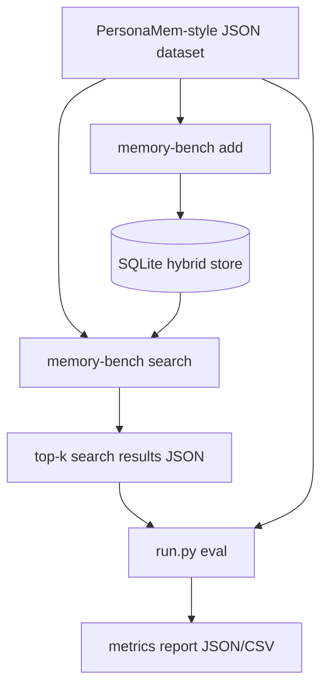

# PersonaMem Evaluation

**[中文](README.zh-CN.md)**

PersonaMem evaluation adapter for RAM-A.

## Dataset

[PersonaMem](https://github.com/bowen-upenn/PersonaMem) (COLM 2025 / NeurIPS 2025) evaluates
how well LLMs infer evolving user profiles and answer personalized multiple-choice questions
from long conversation histories. Three context-length splits: **32k**, **128k**, **1M** tokens;
the 32k split has about 589 questions.

## Setup

```bash
pip install -r evaluation/requirements.txt
cargo build
```

## Pipeline Overview



It reuses the existing `memory-bench` CLI instead of duplicating the memory
logic in Python.

## Expected inputs

The adapter is intentionally schema-light because PersonaMem-style files can be
organized differently across projects. By default it scans recursively for:

- memory text fields: `text,content,message,memory`
- query fields: `question,query`
- gold fields: `answer,ground_truth,gold,evidence,target`

For benchmark scoring, each query should include at least one gold field near
the query object. A retrieved memory is counted as a hit when the gold string
appears as a substring in the retrieved memory text.

This is a first-pass retrieval baseline. LLM judging, answer generation
accuracy, and context-token accounting are separate follow-up layers.

## Quick smoke test

From the repo root:

```bash
python evaluation/personalmem/run.py pipeline \
  --dataset evaluation/fixtures/personalmem_sample.json \
  --store data/personalmem_sample.sqlite \
  --store-backend sqlite \
  --search-mode hybrid \
  --output outputs/personalmem_sample_results.json \
  --report outputs/personalmem_sample_report.json \
  --embedding hash \
  --top-k 2
```

## Environment Variables

| Variable | Used by | Required |
|----------|---------|----------|
| `OPENROUTER_API_KEY` | Embedding (default), answer model (default) | Yes for real runs |

## Model Provider Configuration

PersonaMem also has separate embedding and answer paths:

- Embedding path: `add/search/eval` uses `memory-bench`. It currently supports `--embedding openrouter` or `--embedding hash`; configure `--model` and `--dimensions`. Do not use `hash` for real scores.
- Answer path: the `answer` command uses OpenAI-compatible chat completions. Configure provider with `--answer-model`, `--answer-api-key-env`, and `--answer-base-url`.

Examples:

```bash
# OpenRouter default
export OPENROUTER_API_KEY="..."
python evaluation/personalmem/run.py answer \
  --run-dir "$RUN_DIR" --resume \
  --answer-model openai/gpt-4o-mini \
  --answer-api-key-env OPENROUTER_API_KEY \
  --answer-base-url https://openrouter.ai/api/v1

# Zhipu or another OpenAI-compatible service
export ZHIPU_API_KEY="..."
python evaluation/personalmem/run.py answer \
  --run-dir "$RUN_DIR" --resume \
  --answer-model glm-5 \
  --answer-api-key-env ZHIPU_API_KEY \
  --answer-base-url https://open.bigmodel.cn/api/coding/paas/v4
```

Existing retrieval results can be reused when only the answer model changes. Re-run add/search/eval when changing the embedding model or dimensions.

Do not commit real API keys.

## Commands

```
python evaluation/personalmem/run.py <command> [options]
```

## Official PersonaMem data

The real benchmark data must be downloaded before running. PersonaMem provides
paired files for each context length:

- `questions_32k.csv` + `shared_contexts_32k.jsonl`
- `questions_128k.csv` + `shared_contexts_128k.jsonl`
- `questions_1M.csv` + `shared_contexts_1M.jsonl`

The current adapter supports downloading and preparing these files from
`bowen-upenn/PersonaMem`.

Run a small official-data smoke test:

```bash
python evaluation/personalmem/run.py official-pipeline \
  --size 32k \
  --limit-questions 5 \
  --max-context-messages 50 \
  --prepared-dataset data/personalmem/prepared/personalmem_32k_smoke.json \
  --store data/personalmem_32k_smoke.sqlite \
  --output outputs/personalmem_32k_smoke_results.json \
  --report outputs/personalmem_32k_smoke_report.json \
  --embedding hash \
  --top-k 5
```

Run the 32k split with real embeddings:

```bash
export OPENROUTER_API_KEY="your_openrouter_key"

python evaluation/personalmem/run.py official-pipeline \
  --size 32k \
  --prepared-dataset data/personalmem/prepared/personalmem_32k.json \
  --store data/personalmem_32k_bge.sqlite \
  --output outputs/personalmem_32k_bge_results.json \
  --report outputs/personalmem_32k_bge_report.json \
  --embedding openrouter \
  --model baai/bge-m3 \
  --dimensions 1024 \
  --top-k 10
```

`32k` is the recommended first full run because the official dataset is much
smaller than `128k` and `1M`.

## Commands

Run add only:

```bash
python evaluation/personalmem/run.py add \
  --dataset path/to/personalmem.json \
  --store data/personalmem.sqlite \
  --store-backend sqlite \
  --search-mode hybrid \
  --embedding openrouter
```

| Command | Description |
|---------|-------------|
| `download` | Download official PersonaMem CSV/JSONL files |
| `prepare` | Convert downloaded files into a unified JSON dataset |
| `add` | Add memories to the vector store |
| `search` | Search the store for each question |
| `eval` | Score search results against gold labels |
| `answer` | Generate model answers from retrieved contexts |
| `grade` | Judge answers and compute accuracy |
| `pipeline` | Run add → search → eval |
| `official-pipeline` | Run download → prepare → add → search → eval |

## Key Parameters

| Parameter | Default | Description |
|-----------|---------|-------------|
| `--embedding` | `openrouter` | `openrouter` or `hash` |
| `--model` | `baai/bge-m3` | Embedding model |
| `--dimensions` | 1024 | Embedding dimensions |
| `--top-k` | 10 | Number of results to retrieve |
| `--answer-model` | `openai/gpt-4o-mini` | Chat model for answer stage |
| `--answer-base-url` | `https://openrouter.ai/api/v1` | OpenAI-compatible base URL |
| `--answer-api-key-env` | `OPENROUTER_API_KEY` | Env var for answer API key |
| `--context-token-budget` | 2000 | Max tokens of context in answer prompts (0 = unlimited) |
| `--run-dir` | *(auto)* | Output to `outputs/personalmem/<timestamp>/` |
| `--resume` | false | Skip steps whose output already exists |
| `--size` | `32k` | Official split (`32k`, `128k`, `1M`) |
| `--limit-questions` | 0 | Cap questions for smoke tests |

Full list: `python evaluation/personalmem/run.py <command> --help`

## Quick Smoke Test

```bash
python evaluation/personalmem/run.py pipeline \
  --dataset evaluation/fixtures/personalmem_sample.json \
  --store data/personalmem_sample.sqlite \
  --store-backend sqlite \
  --search-mode hybrid \
  --embedding hash \
  --top-k 2
```

## Full Run (32k)

```bash
export OPENROUTER_API_KEY="your-key"

RUN_DIR=outputs/personalmem/$(date +%Y-%m-%dT%H%M%S)
python evaluation/personalmem/run.py official-pipeline \
  --size 32k --top-k 10 --run-dir "$RUN_DIR"

# Add QA accuracy. Important: answer/grade must reuse the same run_dir created
# by official-pipeline.
python evaluation/personalmem/run.py answer --run-dir "$RUN_DIR" --resume
python evaluation/personalmem/run.py grade --run-dir "$RUN_DIR" --resume
```

`official-pipeline` runs download, prepare, add, search, and retrieval scoring only.
Run `answer` and `grade` afterward when you need final QA Accuracy.
If `--run-dir` is omitted, the script creates a timestamped directory automatically; use the printed `report.html` path to identify the directory for later `answer` and `grade` commands.

## One-Command Full Runs

The v1 shell wrappers run the full PersonaMem flow, including answer generation and grading:

```bash
# RAM-A
evaluation/scripts/run_personalmem_ram_a_v1.sh --size 32k --top-k 20

# mem0 local comparison
evaluation/scripts/run_personalmem_mem0_local_v1.sh --size 32k --top-k 20
```

By default, artifacts are written under:

```
outputs/personalmem/personalmem_<size>_v1_<backend>_top<k>_<context>_<answer-model>/
  search_results.json
  retrieval_metrics.json
  responses.json
  grade_metrics.json
  grade_results.csv
  report.html
  errors.html
  run_meta.json
  stage_reports/
```

Use `--run-dir` to choose a different artifact directory and `--resume` to reuse existing
prepared data, stores, and responses where supported.

## Retrieval Scoring

A hit is counted when the gold string appears as a substring in the retrieved memory text.
The match is one-directional to avoid false positives from short retrieved snippets
matching inside longer gold answers.

## Output Files

```
outputs/personalmem/<timestamp>/
  store.sqlite             # SQLite hybrid store
  search_results.json      # raw top-k results
  retrieval_metrics.json   # hit@k, MRR, per-query breakdown
  responses.json           # generated answers
  grade_metrics.json       # accuracy, per-question breakdown
  grade_results.csv        # CSV summary
  report.html              # main report (retrieval + QA if graded)
  errors.html              # failed-question details if graded
  stage_reports/           # stage HTML files, e.g. retrieval_metrics.html, grade_metrics.html
  run_meta.json            # run metadata
```

## Reference

- [PersonaMem GitHub](https://github.com/bowen-upenn/PersonaMem)
- [PersonaMem-v2 (HuggingFace)](https://huggingface.co/datasets/bowen-upenn/PersonaMem-v2)
- Paper: *Know Me, Respond to Me* (NeurIPS 2025)
